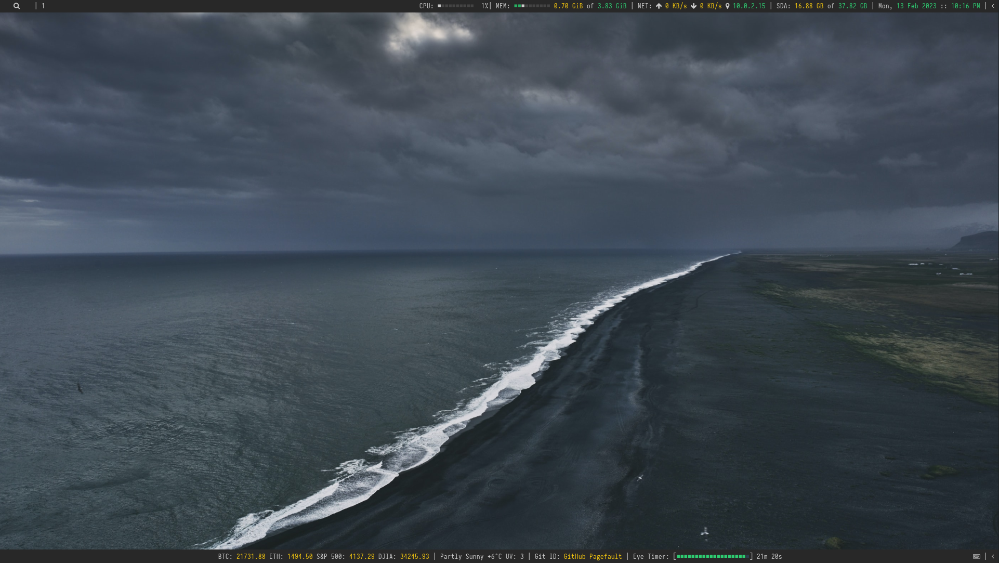
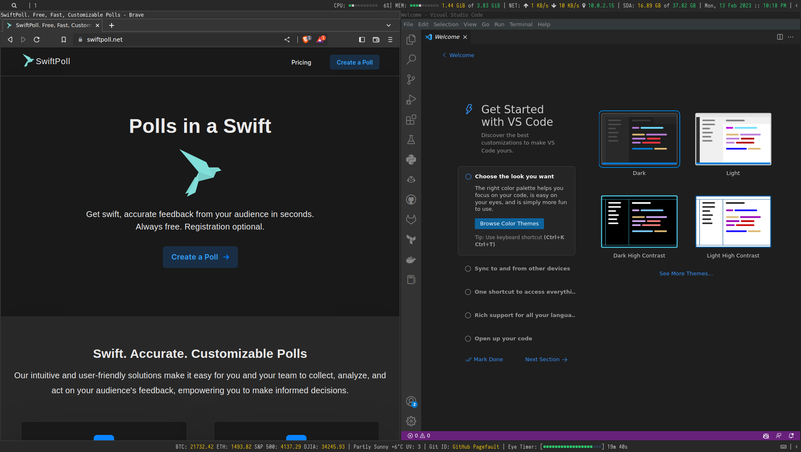
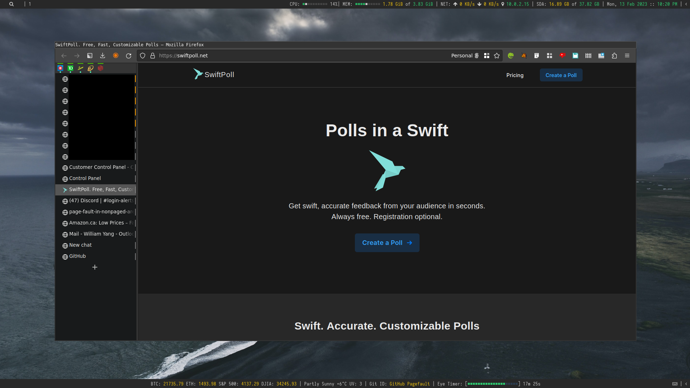

# 🔨 i3-Builder

A tool that builds beautiful, minimalistic i3 Desktop with dual polybars. Works with [Xubuntu](https://xubuntu.org/) 22.04. Intended for use on fresh installations of [Xubuntu](https://xubuntu.org/) 22.04.

Main use cases:
- Provisioning a new desktop
- Migrating from 20.04 to a fresh install of 22.04

## Table of Contents

- [i3-Builder](#i3-builder)

  - [Requirements](#requirements)
  - [Installation](#installation)
  - [Features](#features)
  - [Screenshots](#screenshots)
  - [Known Issues](#known-issues)
  - [Contributing](#contributing)
  - [License](#license)
  - [Feedback](#feedback)

## Requirements

- [Xubuntu](https://xubuntu.org/) 22.04
- user with sudo privileges

----
⚠️ **Please be aware that this tool _may_ damage your system.** 

⚠️ Use at your own risk. You have been warned! 

----

## Installation

The recommended way to install i3-Builder is to prepare everything on an USB or network drive, along with all the required inputs.

### 1. Preparing inputs

1. Firefox
  - Copy everything in `.mozilla/firefox/[id].default` in your current firefox profile into `input/ff.` To find out where `[id].default` is located, goto `about:profiles` in firefox.

2. Git-profiles
  - `git-profiles/profiles.sample.yml` contains an sample yml of various git profiles the polybar git widget can cycle through with clicks. When ready, rename this file to `git-profiles/profiles.yml`. Please note the polybar widget will only work if you have the keys.

3. Keys
  - `input/keys/ssh` and `input/keys/gpg` contain keys to be copied onto the new system. `input/keys/ssh` and `input/keys/gpg` should contain the contents of the `~/.ssh` and `~/.gnupg` on your current system, respectively.

### 2. Run `./install.sh`

- Run `./install.sh` and answer a few prompts! If no errors, log out, log back in, and enjoy your new i3 desktop! 

### 3. Errors and troubleshooting

- If you run into any errors, logs should be available in `output/logs`. Please see [known issues](#known-issues) for more information.

## Features

### 🏠 Desktop Ennvironment

- [i3](https://i3wm.org/) Window Manager
- [Polybar](https://github.com/polybar/polybar), with a modified [grayblocks](https://github.com/adi1090x/polybar-themes/tree/master/simple/grayblocks) theme.
- Polybar widgets:
    - [Crypto, Stocks, Weather](#crypto-stocks-weather)
    - [Git profile changer](#git-profile-changer)
    - [Eye care timer](#eye-care-timer)
    - [Colemak keyboard button](#colemak-keyboard-button)

### 📦 Applications

- [Beekeper studio](https://github.com/beekeeper-studio/beekeeper-studio)
- [Brave browser](https://brave.com/)
- [Chromium](https://github.com/chromium/chromium)
- [Firefox](https://www.mozilla.org/en-US/firefox/new/)
- [Flameshot](https://github.com/flameshot-org/flameshot)
- [Google Cloud SDK](https://cloud.google.com/sdk)
- [GIMP](https://www.gimp.org/)
- [Kazam](https://launchpad.net/kazam)
- [Slack](https://slack.com/intl/en-ca/)
- [Teams](https://www.microsoft.com/en-ca/microsoft-365/microsoft-teams/group-chat-software)
- [Virtualbox](https://www.virtualbox.org/)
- [Visual Studio Code](https://code.visualstudio.com/)

### 🖌️ Polybar Widgets

#### **Crypto, stocks, weather**
- A basic script that checks bitcoin, ethereum, S&P 500, DJIA, and localised weather.

#### **Git profile changer**
- One-click button that makes it easy to switch between git profiles. For example, switching between work and personal.

#### **Eye care timer**
- A simple timer that reminds you to take a break one every ~22 minutes. Simply click to reset.

## Screenshots

Installation screencast coming SOON™️!

## Known Issues

- Depending on the complexity of your firefox profile, this tool **_may_** fail when copying your firefox profile onto the new system. In that case, please see the [Firefox docs](https://support.mozilla.org/en-US/kb/back-and-restore-information-firefox-profiles) on this topic.

- As of Ubuntu 22.04, firefox is installed via snap by default. The snap version of Firefox does not support gtk cursor themes. If you wish to fix this, simply switch to the apt version of firefox. Please See [this](https://askubuntu.com/questions/1432088/mouse-cursor-changes-theme-in-firefox) for more information.

## Contributing

Contributions are welcome! Please feel free to open an issue or PR. There are no plans to support other distros at this time. The roles in apps and system are open to fixes only. No new apps or system roles will be added at this time.

## License

MIT. Please see [LICENSE](LICENSE) for more information.

## Feedback

Do you like `i3-Builder`? Please feel free to join the official poll and discussion here! 👉 https://swiftpoll.net/mNY3/
